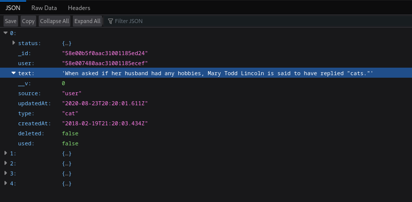
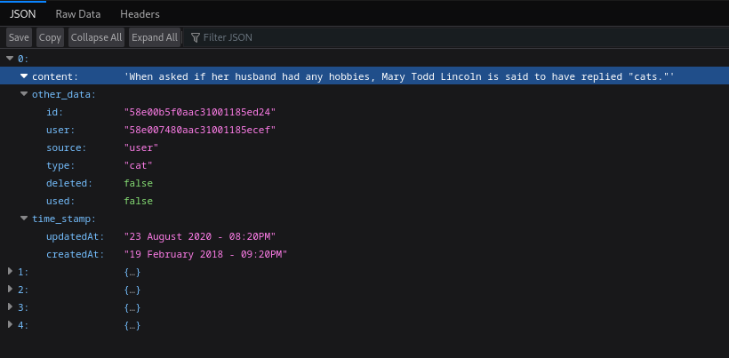

# Spring Boot API Consumer and Mapper

This Spring Boot application demonstrates how to consume a REST API, map the retrieved data to DTOs, and expose the data through a new REST API endpoint. The application includes two images: one illustrating the main API you are consuming and another showing your API's endpoint.

## Getting Started

These instructions will help you set up and run the project on your local machine for development and testing purposes.

### Prerequisites

- Java Development Kit (JDK) 8 or higher
- Gradle (for building the project)
- Your favorite Integrated Development Environment (IDE)

### Installing

1. Clone this repository to your local machine:

   ```shell
   git clone https://github.com/polakDas/consumeRestAPI.git
   ```

2. Open the project in your IDE.

3. Build the project using Gradle:

   ```shell
   gradlew build
   ```

### Running the Application

1. Start the Spring Boot application:

   ```shell
   gradlew bootRun
   ```

2. The application should now be running at [http://localhost:8080](http://localhost:8080).

### API Endpoint

You can access the API endpoint by making a GET request to [http://localhost:8080/](http://localhost:8080/). It returns data retrieved from the main API after mapping it to DTOs.

## Built With

- [Spring Boot](https://spring.io/projects/spring-boot) - The framework used
- [Gradle](https://gradle.org/) - Build tool

## License

This project is licensed under the MIT License - see the [LICENSE.md](LICENSE.md) file for details.

## Acknowledgments

- Thanks to [Alex Wohlbruck](https://cat-fact.herokuapp.com/) for providing the data used in this project.

## Screenshots

### Main API


### Your API

